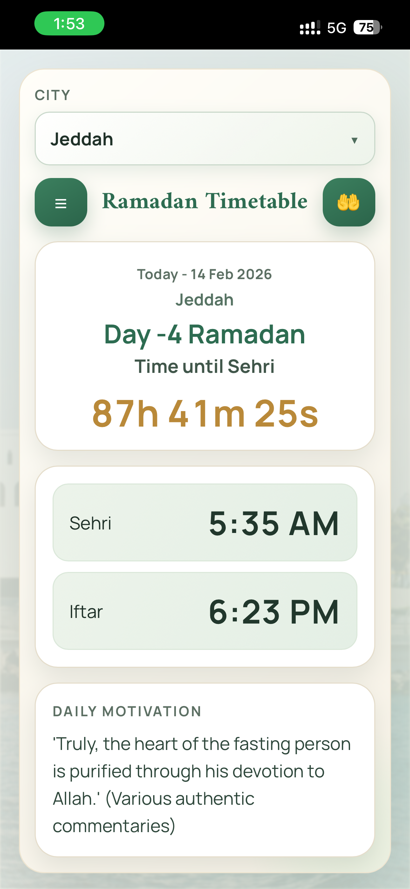
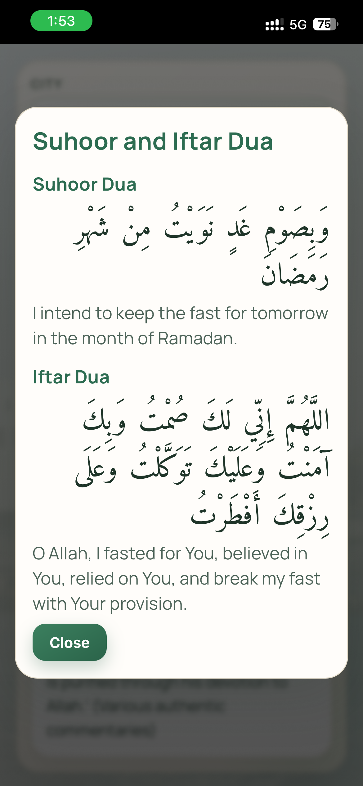
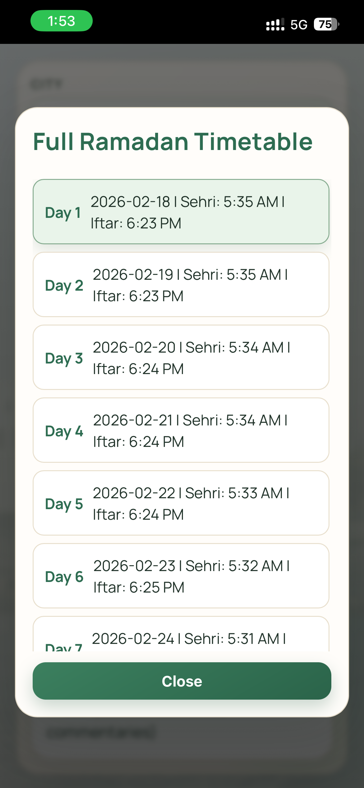

# Ramadan Timetable Web App

> This README was completely written by **Codex**.

A lightweight Ramadan timetable web app with city-based Sehri and Iftar times, a live countdown, daily motivation quotes, and dua/timetable modals.

## 1. Overview of Project

This project is a static web application built with:

- `index.html`
- `style.css`
- `script.js`
- `quotes.js`
- CSV data files under `data/`

The app allows users to:

- Select a city
- View today’s Ramadan day
- See Sehri and Iftar times
- Track a live countdown to the next event
- Read daily motivational quotes
- Open duas and full timetable screens

## 2. How Project Works

The app runs fully on the client side (browser):

1. On load, `script.js` fetches `data/citys.csv`.
2. It builds the city dropdown from this file.
3. When a city is selected, it loads that city’s Ramadan CSV from `data/`.
4. It renders:
   - Current Ramadan day
   - Sehri and Iftar times (12-hour format)
   - Live countdown timer
5. It rotates motivation quotes from `quotes.js`.
6. It stores selected city in browser `localStorage` for next visit.

## 3. How Data Is Stored

### City Registry

File: `data/citys.csv`

Expected columns:

- `city` (display name in dropdown)
- `file` (CSV file name inside `data/`)
- `bg` (optional custom city background image path)

Example:

```csv
city,file
Delhi,ramadan_delhi.csv
```

### Ramadan Timetable Per City

Files: `data/ramadan_<city>.csv`

Expected columns:

- `Day` (1 to 30)
- `RamadanDate` (usually same as Day, optional for display logic)
- `Date` (`YYYY-MM-DD`)
- `Sehri` (`HH:mm`, 24-hour format)
- `Iftar` (`HH:mm`, 24-hour format)

Example:

```csv
Day,RamadanDate,Date,Sehri,Iftar
1,1,2026-02-19,05:25,18:13
2,2,2026-02-20,05:25,18:14
```

### Assets

- City backgrounds: `assets/cities/<city>.jpg`
- App icon: `assets/cities/ramadanIcon.png`

## 4. Process to Add Your City and Create PR

1. Fork this repository.
2. Create a branch:
   ```bash
   git checkout -b add-your-city-name
   ```
3. Add a new timetable file in `data/`:
   - `data/ramadan_<yourcity>.csv`
4. Add your city entry in `data/citys.csv`:
   - Add `city` and `file` values.
   - Optional: add `bg` if you want a custom image path.
5. Add city image to `assets/cities/`:
   - Recommended file name: `<yourcity>.jpg`
6. Verify format:
   - Dates: `YYYY-MM-DD`
   - Time: 24-hour `HH:mm`
   - Keep day order correct.
7. Test locally by running a static server and loading the app.
8. Commit and push:
   ```bash
   git add .
   git commit -m "Add timetable for <your city>"
   git push origin add-your-city-name
   ```
9. Open a Pull Request with:
   - City name
   - Data source used
   - Any notes for review

## 5. Contact for Suggestions

For any suggestions, please contact:

**akramfaiz84@gmail.com**

## 6. How to Use the Web App (All 3 Screens)

### Screen 1: Home / Countdown Screen

What you can do:

- Select your city from the dropdown at top
- View today’s date and Ramadan day
- Check Sehri and Iftar times
- Watch live countdown to next Sehri/Iftar
- Read rotating daily motivation quote

Screenshot:

<a href="./assets/screenshots/home.png">
  
</a>

### Screen 2: Dua Screen

How to open:

- Click the `🤲` button in the top bar.

What it shows:

- Suhoor dua (Arabic + translation)
- Iftar dua (Arabic + translation)

Screenshot:

<a href="./assets/screenshots/dua.png">
  
</a>

### Screen 3: Full Ramadan Timetable Screen

How to open:

- Click the `☰` button in the top bar.

What it shows:

- Full city timetable day-by-day
- Sehri and Iftar for each day
- Highlights current day

Screenshot:

<a href="./assets/screenshots/full-timetable.png">
  
</a>

## Run Locally

Because CSV files are loaded with `fetch`, run the project using a local server (not `file://`).

Example:

```bash
python3 -m http.server 8080
```

Then open:

`http://localhost:8080`

---

If you want, I can also add a short `CONTRIBUTING.md` so PR rules stay separate from the README.
